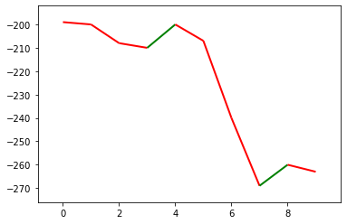
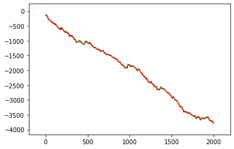

```python
test_data = [int(i) for i in """199 200 208 210 200 207 240 269 260 263""".split()]

def count_increase(data, sep=1):
    return sum([data[i+sep] > data[i] for i in range(0, len(data)-sep)])

clean_data = [int(i) for i in open("input").readlines()]

assert (count_increase(test_data) == 7)
assert (count_increase(test_data,3) == 5)

import numpy as np; np.random.seed(5)
import matplotlib.pyplot as plt
from matplotlib.collections import LineCollection
```


```python
def plot(data):
    x = np.arange(len(data))
    y = np.array(data)

    points = np.array([x, y]).T.reshape(-1, 1, 2)
    segments = np.concatenate([points[:-1], points[1:]], axis=1)

    cm = dict(zip(range(-1,2,1),list("rbg")))
    colors = list( map( cm.get , np.sign(np.diff(y))  ))

    lc = LineCollection(segments, colors=colors, linewidths=2)
    fig, ax = plt.subplots()
    ax.add_collection(lc)

    ax.autoscale()
    ax.margins(0.1)
    plt.show()
```


```python
plot([0-i for i in test_data])
```


    

    


```python
plot([0-i for i in clean_data])
```


    

    


```python
print(f"Solution 1 :{count_increase(clean_data)}")
print(f"Solution 2 :{count_increase(clean_data,3)}")
```

    Solution 1 :1292
    Solution 2 :1262
    


```python

```
