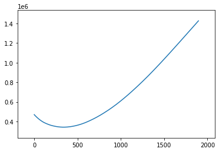
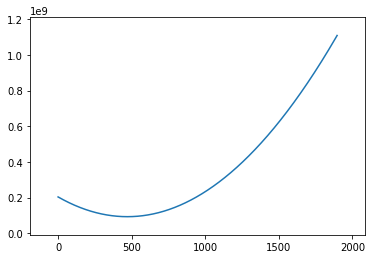

```python
from collections import defaultdict

test_data = """16,1,2,0,4,2,7,1,2,14"""

def observe(raw_data):
    return [int(i) for i in raw_data.split(",")]

def position(crabs_list):
    all_positions=defaultdict(int)
    for crab in crabs_list:
        all_positions[crab]+=1
    return all_positions

def fuel_use(positions_crabs,to_position):
    return sum([abs(current_position - to_position) * weight for current_position,weight in positions_crabs.items()])

def correct_fuel_use(positions_crabs,to_position):
    return sum([compute_crab_fuel(abs(current_position - to_position)) * weight for current_position,weight in positions_crabs.items()])

def compute_crab_fuel(distance):
    return ((distance+1)*distance)//2

def explore(all_positions, func=fuel_use):
    return [func(positions,current_position) for current_position in range(min(all_positions.keys()),max(all_positions.keys()))]

data=open("input.txt").readline()
crabs = observe(data)

import numpy as np; np.random.seed(5)
import matplotlib.pyplot as plt

positions=position(crabs)
y = np.array(explore(position(crabs)))

_, ax = plt.subplots()
ax.plot(y)

ax.autoscale()
ax.margins(0.1)
plt.show()
```


    

    


```python
y = np.array(explore(position(crabs),correct_fuel_use))

_, ax = plt.subplots()
ax.plot(y)

ax.autoscale()
ax.margins(0.1)
plt.show()

```


    

    

